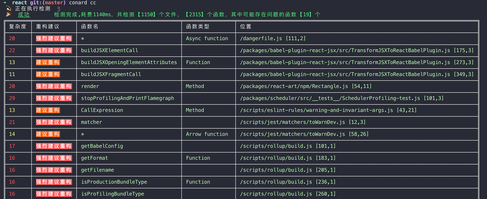
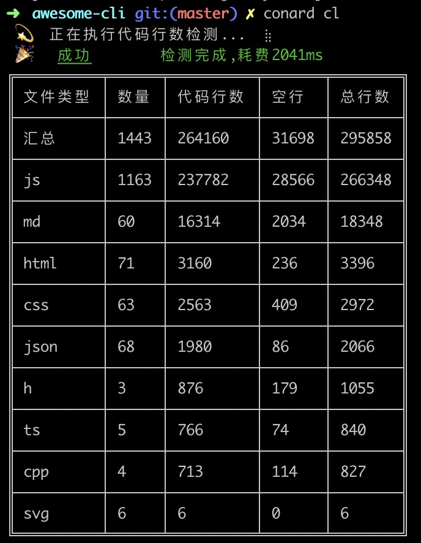

# awesome-cli

awesome cli tools （有趣又实用的命令行工具）


## npm包

> 提供底层数据，可以灵活扩展。

### scan

代码扫描工具，详细文档：[code-scan](./code-scan/)

```js
npm i c-scan --save
```

### code-complexity

代码复杂度检测，详细文档：[code-complexity](./code-complexity/)

```js
npm i c-complexity --save
```

### code-stats

代码统计工具，详细文档：[code-stats](./code-stats/)


## cli 工具

> 提供命令行可视化。


```js
npm i conard --g
```

- `cc` 代码复杂度统计

- `cl` 代码行数统计

### cc

切换到项目目录下，执行：

```js
conard cc
```



### cl

切换到项目目录下，执行：

```js
conard cl
```


