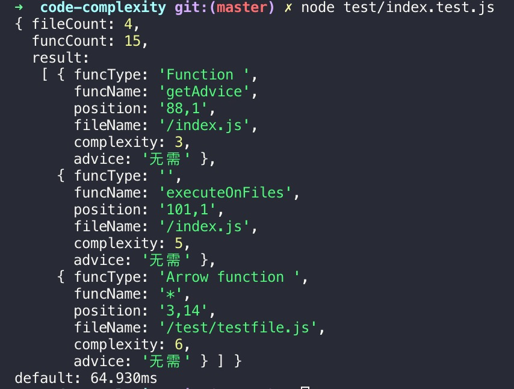

# code-complexity

代码复杂度检测工具

```js
npm i c-complexity --save
```

```js
const cc = require('c-complexity');
cc({},10);
```

## 返回值

- fileCount：文件数量
- funcCount：函数数量
- result：详细结果
    - funcType：函数类型
    - funcName；函数名称
    - position：详细位置（行列号）
    - fileName：文件相对路径
    - complexity：代码复杂度
    - advice：重构建议




## 参数

```js
cc(scanParam,min);
```

### scanParam

代码扫描的参数，参考：[code-scan](../code-scan/)

### min

最小提醒代码复杂度，默认为1

