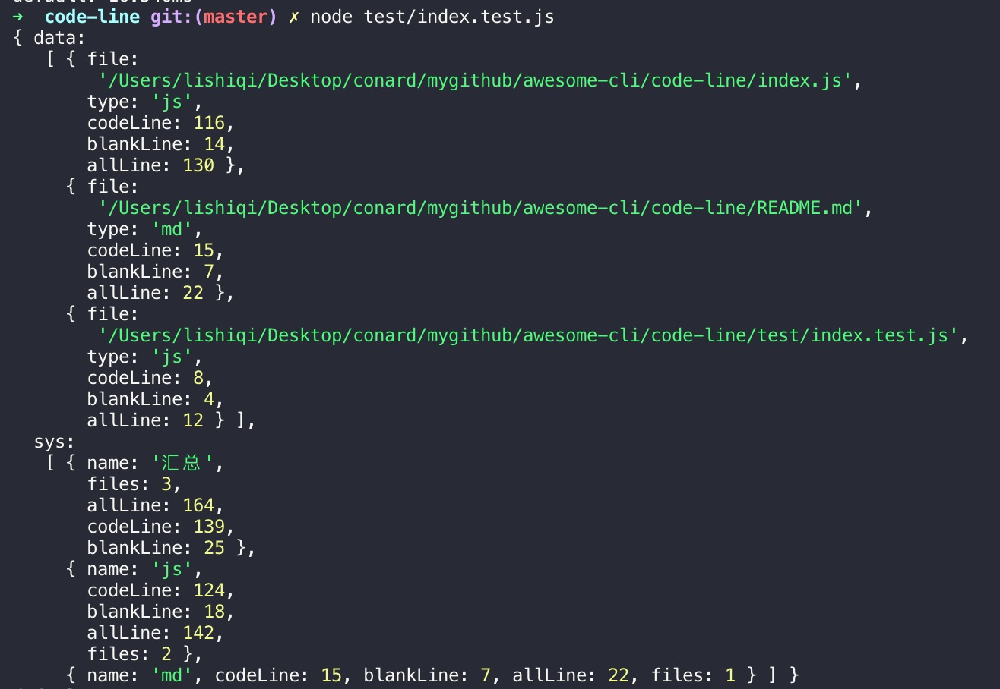

# code-line

代码行数统计工具

```js
npm i c-line --save
```

```js
const cc = require('c-line');
const result = await cc({ extensions: '**/+(*.js|*.md)' });
```

## 返回值

- data：各文件统计结果明细
    - file：文件绝对路径
    - type：文件类型（扩展名）
    - codeLine：代码行数
    - blankLine：空行行数
    - allLine ：总行数

- sys：统计结果汇总数据
    - name：文件类型类型
    - codeLine：代码行数
    - blankLine：空行行数
    - allLine：总行数
    - files：文件数量
    



## 参数

```js
cc(scanParam,min);
```

### scanParam

代码扫描的参数，参考： [code-scan](../code-scan/)